# Foodie - FLYT-skjema

Dette dokumentet viser flyten i appen, fra oppstart til alle hovedfunksjoner.

## 1. App Oppstart & Autentisering

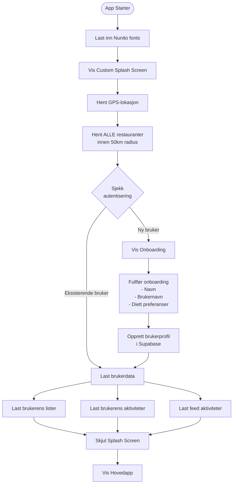

## 2. Hovednavigasjon (Bottom Tabs)

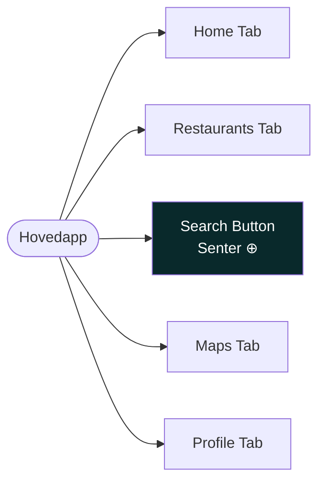

## 3. Home Screen Flyt

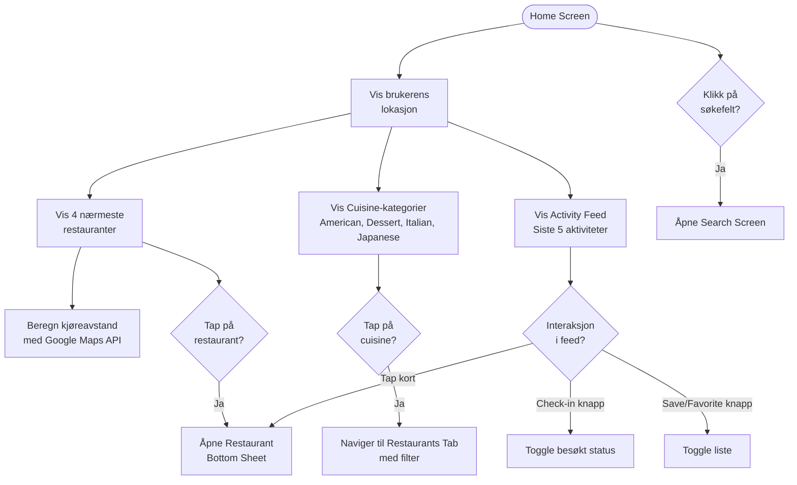

## 4. Restaurant Bottom Sheet Flyt

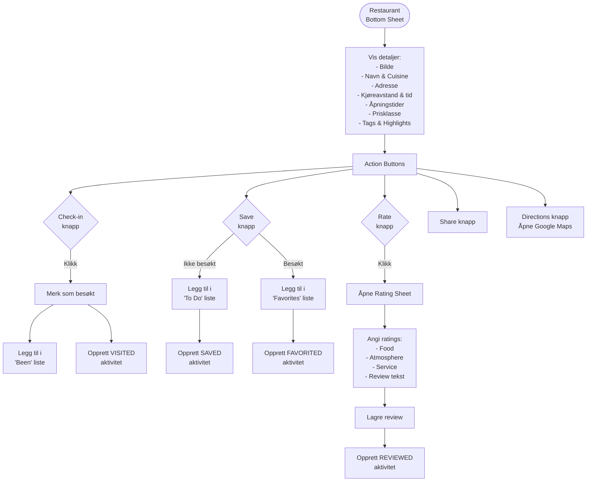

## 5. Search Screen Flyt

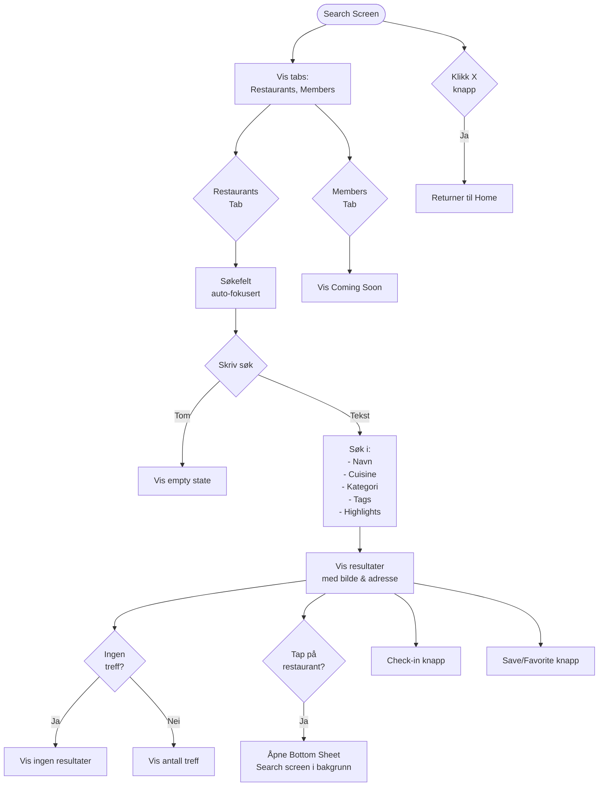

## 6. Restaurants Tab (YourList) Flyt

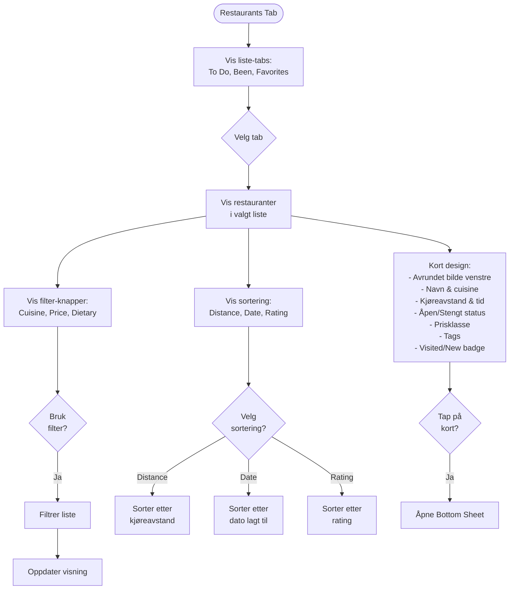

## 7. Maps Screen Flyt

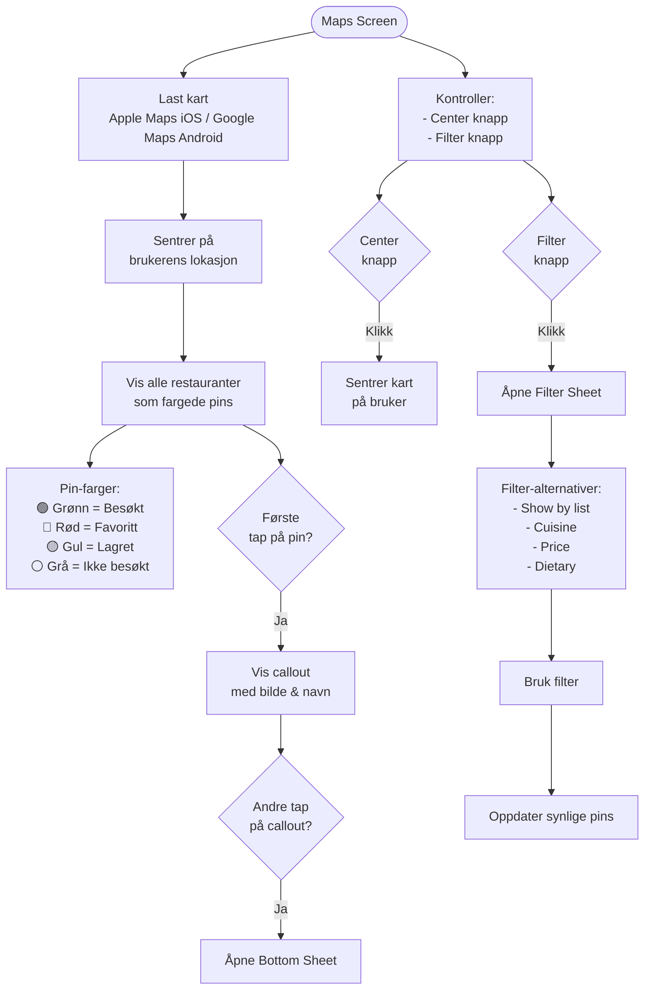

## 8. Profile Screen Flyt

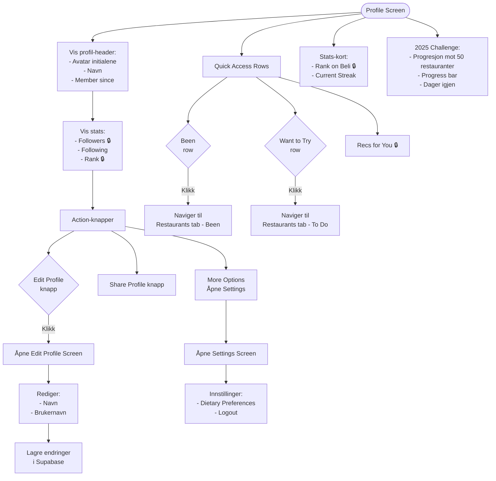

## 9. Data Flow & State Management

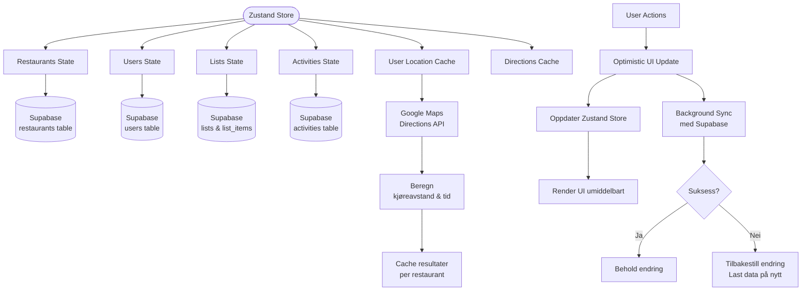

## 10. Nøkkelteknologier

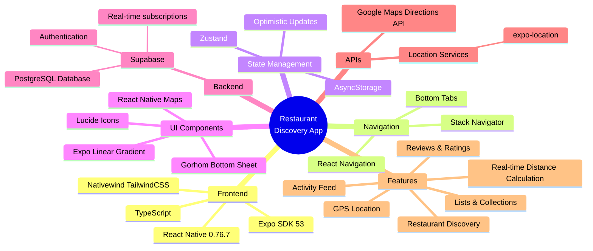

## 11. Aktivitetstyper & Feed

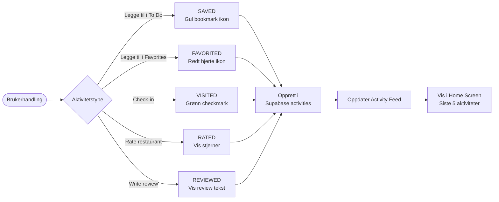

## 12. Filtrering & Sortering

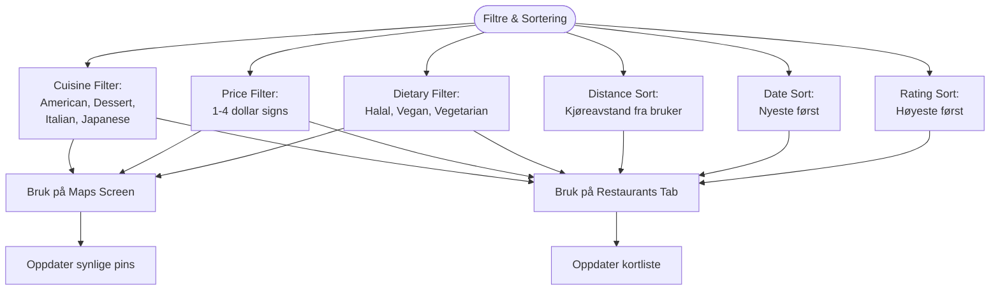

---

## Oppsummering av Flyten

### Oppstartssekvens:
1. Last fonts og vis splash screen
2. Hent GPS-lokasjon
3. Hent alle restauranter innen 50km
4. Sjekk autentisering (ny/eksisterende bruker)
5. Hvis ny: Vis onboarding → Opprett profil
6. Hvis eksisterende: Last brukerdata
7. Skjul splash → Vis hovedapp

### Hovedfunksjoner:
- **Home**: Nærmeste restauranter, cuisine-kategorier, activity feed
- **Restaurants**: Lister (To Do, Been, Favorites) med filtrering og sortering
- **Search**: Søk i restauranter med interaktive resultater
- **Maps**: Visuelt kart med fargekodede pins og filtre
- **Profile**: Brukerstatistikk, lister, utfordringer, innstillinger

### Data-flyt:
- Optimistic updates for øyeblikkelig UI-respons
- Background sync med Supabase for persistent lagring
- Caching av lokasjons- og rute-data for ytelse
- Real-time updates av aktiviteter i feeden
